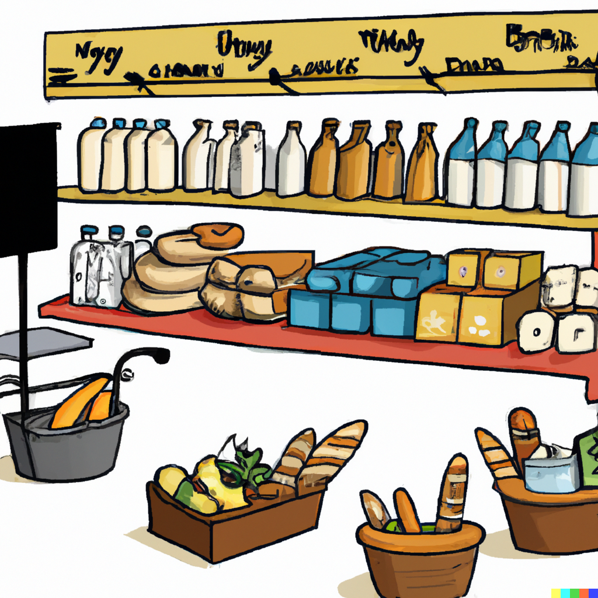
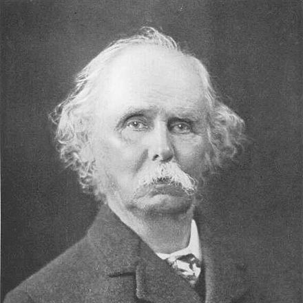

```{r setup, include=FALSE, message=FALSE, warning=FALSE}
knitr::opts_chunk$set(echo = FALSE)
library(data.table)
library(ggplot2)
library(cowplot)
library(extrafont)
loadfonts(device="win",quiet=T)
```


# What consumer wants is not what consumer gets

.pull-left[

]

.pull-right[
- A consumer at any given occasion faces an array of choices. These choices are connected with their *needs* and *wants*. 
- Ideally, the consumer would like to have all that they need or want, but their choices are constrained by their disposable income - the budget allocated for purchasing goods. 
- The objective of a consumer, then, is to select a subset of goods that give them the *best* satisfaction, subject to their budget constraint. 
]

---


# That weird economic measure of happiness

.right-column[
- Economists define "best" in terms of consumers' attempts to maximize their *utility*. 
- Utility is an economic term describing satisfaction from the consumption of goods. 
- Utility is a unit-free measure (i.e., it is not defined in terms of dollars or kilograms, for example).
- But in general, more utility is better than less utility, and positive utility is "good" and negative utility is "bad."
]

---


# Maximizing utility subject to budget constraint

.right-column[
- Mathematically, for a set of goods, $\{x_1,\ldots,x_n\}$, the utility approach to the theory of demand is given by: $$\max U(\mathbf{x}),\;~~s.t.\;~p_1x_1+\ldots+p_nx_n \leq M,$$ where $\{p_1,\ldots,p_n\}$ is a vector of prices for the given set of goods, and $M$ is the total disposable income (i.e., the budget). 
- Thus, a consumer tries to attain the maximum utility they can afford, given their income and the prices of goods.
]

---


# Choice and individual demand

.right-column[
```{r demand, out.width='100%', fig.asp=0.5, dpi=300, echo=FALSE, warning=FALSE, cache=TRUE}

x <- seq(0.0,110,0.1)

r <- .25

M <- 100
p1 <- 1
p2 <- 2

xp1 <- (p1^(1/(r-1)))/(p1^(r/(r-1))+1^(r/(r-1)))*M
xp2 <- (p2^(1/(r-1)))/(p2^(r/(r-1))+1^(r/(r-1)))*M

yp1 <- (1^(1/(r-1)))/(1^(r/(r-1))+p1^(r/(r-1)))*M
yp2 <- (1^(1/(r-1)))/(1^(r/(r-1))+p2^(r/(r-1)))*M

U1 <- M*(p1^(r/(r-1))+1^(r/(r-1)))^((1-r)/r)
U2 <- M*(p2^(r/(r-1))+1^(r/(r-1)))^((1-r)/r)

y1 <- (U1^r-x^r)^(1/r)
y2 <- (U2^r-x^r)^(1/r)

b1 <- M/1-p1/1*x
b2 <- M/1-p2/1*x

dt1 <- data.table(x,y1,y2,b1,b2)

gg1 <- ggplot(dt1)+
  geom_line(aes(x=x,y=y1),linewidth=.8,color="indianred",na.rm=T)+
  geom_line(aes(x=x,y=y2),linewidth=.8,color="indianred",na.rm=T)+
  geom_line(aes(x=x,y=b1),linewidth=.8,color="dimgray",linetype=5,na.rm=T)+
  geom_line(aes(x=x,y=b2),linewidth=.8,color="dimgray",linetype=5,na.rm=T)+
  geom_segment(aes(x=0,y=yp1,xend=xp1,yend=yp1),linetype=3,linewidth=.6)+
  geom_segment(aes(x=xp1,y=yp1,xend=xp1,yend=0),linetype=3,linewidth=.6)+
  geom_segment(aes(x=0,y=yp2,xend=xp2,yend=yp2),linetype=3,linewidth=.6)+
  geom_segment(aes(x=xp2,y=yp2,xend=xp2,yend=0),linetype=3,linewidth=.6)+
  labs(x=expression(x[1]),y=expression(x[2]))+
  scale_x_continuous(expand=c(0,0),limits=c(0,115))+
  scale_y_continuous(expand=c(0,0),limits=c(0,115))+
  theme_classic()+
  theme(axis.title=element_text(size=16,hjust=1,vjust=1,family="Segoe Print"),axis.title.y=element_text(angle=0,family="Segoe Print"),axis.text=element_text(size=14),plot.margin = margin(1,0,0,0,"cm"))

p <- seq(.5,4,0.01)
xp <- (p^(1/(r-1)))/(p^(r/(r-1))+1^(r/(r-1)))*M

dt2 <- data.table(p,xp)

gg2 <- ggplot(dt2)+
  geom_line(aes(x=xp,y=p),linewidth=.8,color="indianred",na.rm=T)+
  geom_segment(aes(x=0,y=p1,xend=xp1,yend=p1),linetype=3,linewidth=.6)+
  geom_segment(aes(x=xp1,y=p1,xend=xp1,yend=0),linetype=3,linewidth=.6)+
  geom_segment(aes(x=0,y=p2,xend=xp2,yend=p2),linetype=3,linewidth=.6)+
  geom_segment(aes(x=xp2,y=p2,xend=xp2,yend=0),linetype=3,linewidth=.6)+
  labs(x=expression(x[1]),y=expression(p[1]))+
  scale_x_continuous(expand=c(0,0),limits=c(0,115))+
  scale_y_continuous(expand=c(0,0),limits=c(0,4.5))+
  theme_classic()+
  theme(axis.title=element_text(size=16,hjust=1,vjust=1,family="Segoe Print"),axis.title.y=element_text(angle=0),axis.text=element_text(size=14,family="Segoe Print"),plot.margin = margin(1,0,0,0,"cm"))


plot_grid(gg1,gg2,align="h",nrow=1,labels=c("Optimal Bundle","Individual Demand"),label_colour="dimgray",hjust=0)
```
]

---


# Substitution effect

.right-column[
- Market determines prices of goods - i.e., a consumer has no control over the prices. 
- Changes to prices affect a consumer's decision-making. 
- A consumer can afford and, thus, will purchase more of the same good as the price of the good drops. 
- This is known as the *substitution effect*. 
- The substitution effect is inversely related to the price change.
]

---


# Income effect

.right-column[
- A decrease in price of a good, in effect, is equivalent to an increase in income - a consumer can afford more of all goods with the same amount of money. 
- This is known as the *income effect*. 
- The income effect usually (but not necessarily) is inversely related to the price change. 
- Thus, a price drop will typically increase the quantity demanded due to the income effect as well as the substitution effect. 
]

---


# Inferior goods

.right-column[
- For some goods, real income and demand are inversely related. This is like the negative income effect due to price decrease. 
- Such goods are called *inferior goods*. 
- For inferior goods, the income and the substitution effects have opposite signs.
- In most instances, the expenditure share of a good is a small fraction of the disposable income; thus, the substitution effect typically dominates the income effect.
]

---


# Giffen goods

.right-column[
- At the extreme, the income effect might outweigh the substitution effect, resulting in a positively sloped demand curve. 
- This is known as *Giffen's paradox*, and such goods are referred to as the *Giffen goods*. 
- It might occur, for example, when a staple commodity, such as rice, constitutes a large portion of consumer's expenditures. 
- By the same token, if the income effect outweighs the substitution effect, we might observe a negative relationship between the demand for product $i$ and the change in price of product $j$, even when the two are substitutes. 
]

---


# Marshallian demand

.pull-left[
```{r, out.width = "300px"}

```
Alfred Marshall, 1842-1924
Credit: [Wikipedia](https://en.wikipedia.org/wiki/Alfred_Marshall)
]

.pull-right[

- The Marshallian demand curve combines both the income and substitution effects of a price change. It is also known as the *uncompensated* demand curve.
- By contrast, the Hicksian demand curve, which is also known as the *compensated* demand curve, only accounts for the substitution effect of a price change (by holding utility constant)

]

---


# Lancastrian demand

.pull-left[
```{r, out.width = "300px"}

```
Kelvin Lancaster, 1924-1999
Credit: [The HET website](https://www.hetwebsite.net/het/profiles/lancaster.htm)
]

.pull-right[

- The Lancastrian demand is based on the assumption that a good is nothing more than a bundle of attributes (comprising the good).
- So, our demand for the good is the sum of our demands for its attributes.
]

---


# Market demand

.right-column[
- We obtain aggregate or market demand when we add up (horizontally) individual consumer demand functions. 
- Market demand is a schedule of product quantities that all consumers in a market are willing to purchase at given prices, everything else held constant. 
- Normally, the demand curve is downward sloping, which is inferred in the *law of demand*.
]

---


# Movement along the curve vs shifting the curve

.right-column[
- The own price is the sole factor affecting the quantity demanded, which results in *movement along the demand curve*. 
- All other factors affect demand by *shifting the demand curve*. 
- These factors can be:
  * economic (e.g., prices and availability of other goods and services, income and its distribution); 
  * demographic (population size and its distribution by age, gender, ethnicity, etc.); 
  * tastes and preferences (influenced by information and advertising, lifestyle, etc.).
]

---


# Own price elasticity of demand

.right-column[
- The responsiveness of quantity demanded to a price change - known as the *own-price elasticity of demand* (or, simply, the *demand elasticity*) - may vary from product to product, over time, and across locations.
  * we buy the same amount of salt when its price changes, but our purchase of bananas is more responsive to price changes. From a consumers' standpoint, bananas have substitutes, salt doesn't. 
  * quantity of rice purchased is less responsive to price changes in Asia, where it is a staple food, than in Europe, where it is more as a side dish, perhaps with more substitutes.
]

---


# Own price elasticity of demand

.right-column[
- Mathematically, price elasticity is given by: $$\epsilon = \frac{\partial Q}{Q}/\frac{\partial P}{P},$$ where $\partial$ denotes an infinitesimal change. 
- Note that $100\%\times\frac{\partial X}{X} \equiv \%\Delta X$, and so price elasticity is defined as the percentage change in quantity relative to the percentage change in price. 
]

---


# Own price elasticity of demand

.right-column[
- The previous equation can be rewritten as: $$\epsilon = \frac{\partial Q}{\partial P}\frac{P}{Q},$$ where $\frac{\partial Q}{\partial P}$ is the slope of the demand curve. 
- That the elasticity is measured in relative terms, makes it an attractive measure as it helps with a direct comparison between goods with possibly different units of measurement of quantities and prices. 
]

---


# Own price eleasticity of demand

.right-column[
- Because of the downward-sloping demand curve, the price elasticity measure will necessarily be negative. 
- The magnitude of the elasticity measure helps us differentiate between *inelastic*, $|\epsilon_{ii}| < 1$, and *elastic*, $|\epsilon_{ii}| > 1$, segments of the demand curve, with $|\epsilon_{ii}| = 1$ representing the *unit-elastic* case.
]

---


# Own price eleasticity of demand

.right-column[
- For most functional forms, including the linear demand, the elasticity coefficient varies along the demand curve. 
- Exceptions are if demand is represented by a horizontal line, a vertical line, a power function, and a rectangular hyperbola. 
- In general, demand for different goods is usually categorized as elastic or inelastic.
]

---


# Cross price elasticity of demand

.right-column[
- The responsiveness of the demand for a good $i$ to a price changes of a good $j$ is known as the cross-price elasticity of demand. 
- Mathematically, $$\epsilon_{ij} = \frac{\partial Q_i}{Q_i}/\frac{\partial P_j}{P_j},$$ or, $$\epsilon_{ij} = \frac{\partial Q_i}{\partial P_j}\frac{P_j}{Q_i}$$
]

---


# Cross price elasticity of demand

.right-column[
- Three types of relationships - which are related to the substitution effect - can be identified depending on the sign of cross-price elasticity: substitute goods, $\epsilon_{ij} > 0$; complement goods, $\epsilon_{ij} < 0$; and independent goods, $\epsilon_{ij} = 0$.
]

---


# Income elasticity of demand

.right-column[
- The responsiveness of the demand for a good to income changes is income elasticity of demand (income elasticity). 
- Mathematically, income elasticity is given by: $$\epsilon_{m} = \frac{\partial Q}{Q}/\frac{\partial M}{M},$$ or, alternatively: $$\epsilon_{m} = \frac{\partial Q}{\partial M}\frac{M}{Q}$$
]

---


# Income elasticity of demand

.right-column[
- Three types of goods can be identified based on the sign and magnitude of income elasticity. These are normal goods, $0 \le \epsilon_{m} \le 1$; superior goods, $\epsilon_{m} > 1$; and inferior goods, $\epsilon_{m} < 0$.
]

---


# Income elasticity of demand

.right-column[
- Typically, the income elasticity of demand has a positive value: as income increases, consumers tend to buy more of most products. 
- However, income elasticities tend to decline as incomes increase. 
- As a consequence, for a very low-income country, the income elasticity of demand for food (as a whole) is around $0.8$, while for a very high-income country it is around $0.1$. 
- This difference in income elasticities means that changes to income have a much larger relative impact on food demand in low-income countries than in high-income countries.
]

---


# Engel's law

.right-column[
- By necessity, poor people have no choice but to spend the large share of their income on food, at times as much as 80 percent; and when their incomes rise, they buy more food. 
- Eventually, as the income grows, people start spending more of it on other items. 
- People spending a smaller share of income on food, as their income increases, is known as *Engel's law*.
]

---


# Bennett's law

.right-column[

- Rising incomes lead people to consume more total calories, and also to consume more expensive foods. 
- These foods are often more highly processed, and include more animal products as well as more fruits and vegetables. 
- The transition in consumption from a few inexpensive starchy staples to the greater variety of more expensive foods is known as *Bennett's law*. 
- Such transition does not necessarily decrease demand for cereal grains, however. While consumers reduce their direct consumption of cereal grains as food, they increase the total usage of cereal grains as animal feed.
]

---


# Readings

.pull-left[

]

.pull-right[
Tomek & Kaiser, Chapters 2 & 3

Norton, Alwang & Masters, Chapter 3
]
