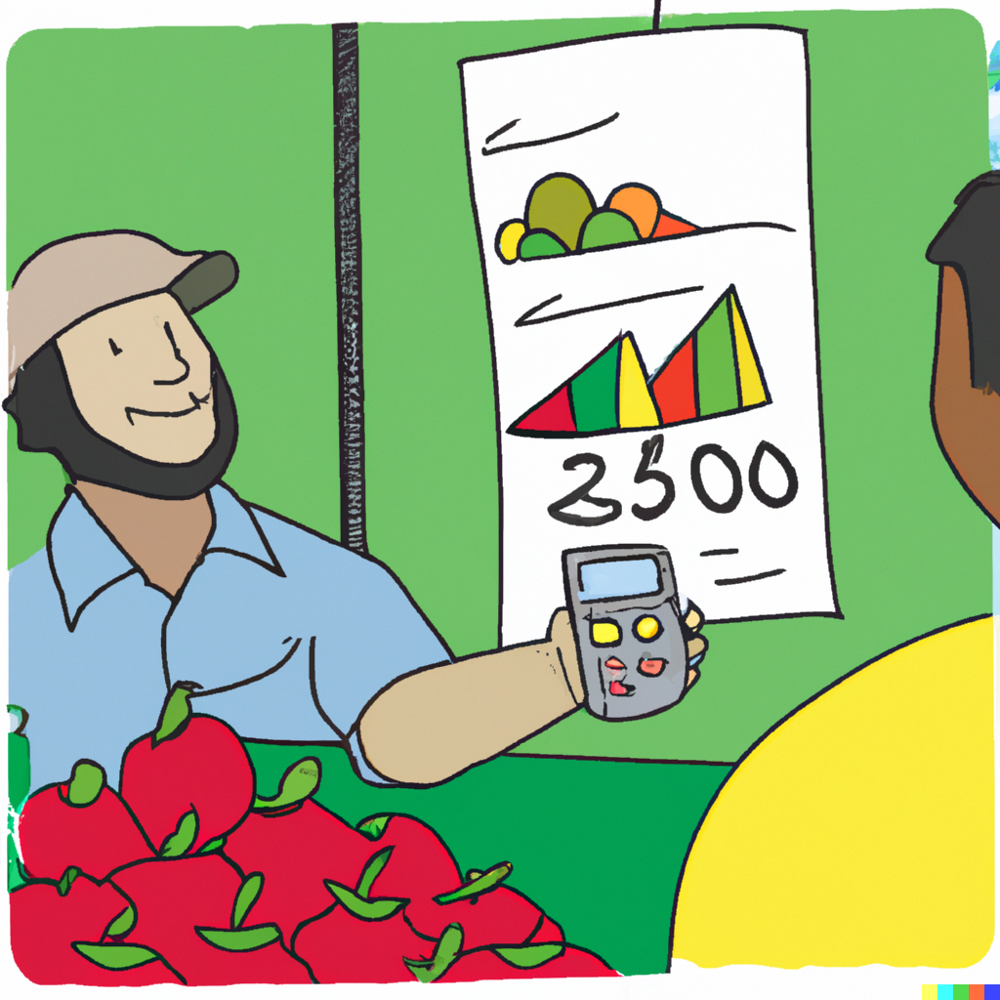

```{r setup, include=FALSE}
knitr::opts_chunk$set(echo = FALSE)
library(data.table)
library(ggplot2)
library(geomtextpath)

x <- seq(0,25,0.1)

aa <- 65
bb <- -2
cc <- 5
dd <- 3

D <- aa+bb*x
MR <- aa+2*bb*x
S <- cc+dd*x
```

# Market Structure

.pull-left[

]

.pull-right[
- Markets are commonly classified in relation to the number of sellers, assuming many buyers.
- Under such classification, four general types of markets are considered:
  * Perfectly competitive (many sellers);
	*	Monopolistic (one seller);
	* Oligopolistic (a few sellers);
	* Monopolistically competitive (many sellers of differentiated products).
- The ``flip side'' of such markets may also be relevant (e.g., Monopsony and Oligopsony).
]

---


# Perfect competition

.right-column[
- For perfectly competitive markets we assume that: 
  * there are many sellers and buyers in a market, and that each individual seller or buyer cannot influence the market; 
  * all firms produce homogeneous product; 
  * there are no costs for entering and leaving the market; and 
  * the information on economic forces that are determining prices is complete and freely available for market participants. 
]

---


# Perfect competition

.right-column[
- A perfectly competitive firm's objective is to maximize profit: $$\max_q\pi = pq-c(q),$$ where $p$ is price, $q$ is output quantity, and $c(q)$ is the total cost of producing $q$ units of output.
- The profit-maximization results in $p = c'(q)$, where $c'(q)\equiv MC$.
- A perfectly competitive market is efficient, in the sense that the market equilibrium leads to the socially optimal outcome.  
]

---

# Perfect competition

.pull-right[
```{r competition, out.width='90%', fig.asp=0.8, dpi=200, echo=FALSE, warning=FALSE, cache=FALSE}

dt <- data.table(x,D,S)

dl <- melt(dt,id.vars="x")

ggplot(dl,aes(x=x,y=value,color=variable))+
  geom_textline(aes(label=variable),size=6,linewidth=1,na.rm=T,hjust=.85)+
  labs(x="Q",y="P")+
  scale_x_continuous(expand=c(0,0),limits=c(0,28))+
  scale_y_continuous(expand=c(0,0),limits=c(0,88))+
  scale_color_manual(values=c("coral","steelblue"))+
  theme_classic()+
  theme(axis.title = element_text(size=18), axis.text = element_text(size=16),plot.margin = margin(1,0,0,0,"cm"),legend.position = "none",axis.title.x=element_text(hjust=.98),axis.title.y=element_text(vjust=.98,angle=0),axis.line = element_line(arrow = arrow(type='closed', length = unit(10,'pt'))))
```
]

---


# Monopolistic competition

.right-column[
- Monopolistic competition relaxes the assumption of product homogeneity.
- There still are many sellers on the market, but each seller has an option to differentiate their product in some way or another
- At the extreme, such differentiation can lead to an almost unique product, in which case the seller, in effect, becomes a monopolist.  
]

---


# Monopoly

.right-column[
- Market structure with a single seller is called monopoly. 
  * The assumption of product homogeneity is irrelevant.
  * There are insurmountable costs of entry.
- A monopolist, unlike a competitive firm, is no longer a price-taker; instead, they can 'manipulate' quantity demanded by changing prices or, equivalently, they can manipulate market prices by changing output. 
]

---


# Monopoly

.right-column[
- Thus, a monopolist's objective, like that of a competitive firm, is to maximize profit: $$\max_q\pi = p(q)q-c(q),$$ where $q$ is quantity, $p(q)$ is price (as a function of quantity), and $c(q)$ is the total cost of producing $q$ units of output.
- The profit-maximization results in: $$p'(q)q+p(q) = c'(q)$$
]

---


# Monopoly

.right-column[
- An algebraic manipulation of the profit-maximization outcome results in: $$p\left(1+\frac{1}{\epsilon}\right),$$ where $\epsilon$ is the elasticity of demand (and is negative).
- This relationship suggests that when the demand is perfectly elastic, the monopoly operates as a perfectly competitive firm.
- This equation also suggests that a monopoly will only operate in the elastic range of demand.
]

---

# Monopoly

.right-column[
- Market equilibrium under monopoly leads to an inefficient outcome, as some of the surplus&mdash;which would have been attained under a perfectly competitive market&mdash;is lost; such loss is referred to as the *dead-weight loss*.
]

---

# Monopoly

.pull-right[
```{r monopoly, out.width='90%', fig.asp=0.8, dpi=200, echo=FALSE, warning=FALSE, cache=FALSE}

dt <- data.table(x,D,S,MR)

dl <- melt(dt,id.vars="x")

ggplot(dl,aes(x=x,y=value,color=variable))+
  geom_textline(aes(label=variable),size=6,linewidth=1,na.rm=T,hjust=.85)+
  labs(x="Q",y="P")+
  scale_x_continuous(expand=c(0,0),limits=c(0,28))+
  scale_y_continuous(expand=c(0,0),limits=c(0,88))+
  scale_color_manual(values=c("coral","steelblue","indianred"))+
  theme_classic()+
  theme(axis.title = element_text(size=18), axis.text = element_text(size=16),plot.margin = margin(1,0,0,0,"cm"),legend.position = "none",axis.title.x=element_text(hjust=.98),axis.title.y=element_text(vjust=.98,angle=0),axis.line = element_line(arrow = arrow(type='closed', length = unit(10,'pt'))))
```
]

---


# Monopoly

.right-column[
- A monopolist may extract profits above and beyond the 'monopoly profits', if they can exercise the *price discrimination* strategy; i.e., if they can segment the market and charge different prices.
- The following conditions must be met for this:
  * It must be possible to identify different markets with distinct demand elasticities;
  * The markets must be separated&mdash;there should be no arbitrage opportunity between the markets
- Under these conditions, a monopolist can further increase profits by charging higher prices in markets with less elastic demand.
]

---


# Pricing Mechanisms

.right-column[
- Within a market structure, prices are established or 'discovered' by means of institutional mechanisms and arrangements that facilitate the interaction between buyers and sellers.
- In a perfect market, all participants have access to the same information at no cost, and hence prices reflect the existing economic conditions. As new information arrives, prices change instantly to a new equilibrium (efficient market hypothesis). 
]

---


# Pricing Mechanisms

.right-column[
- Pricing mechanisms can influence the costs of price discovery, and therefore prices, at least indirectly though outcomes they generate.
- Three broad categories of pricing mechanisms include:
  * negotiation - a bargaining that may be formal or informal;
  * auctions - a type of bidding done in a structured setting;
  * administering - price-setting of some sort.
]

---


# Negotiated Prices

.right-column[
- An informal negotiation between the involved parties is not uncommon, as it is potentially the least-cost method  of price discovery for locally marketed commodities of varying quality. 
- A formal negotiation typically involves a union, a cooperative of farmers, who negotiate the terms of sales on behalf of individuals they represent. Such negotiation takes a structured bargaining form, and if successful, results in a contract for a specific time period that details benefits and responsibilities. 
]

---


# Auctions

.right-column[
- Auctions is a structured framework for bidding, using clearly defined rules.
- An ascending bid auction, better known as the 'English auction' is one of the most common types of auctions. The auction starts at some reservation price, and is complete once no-one is willing to bid higher than the most recent bid. Such auction, typically, leads to over-bidding&mdash;a phenomenon referred to as the 'winner's curse.'
]

---

# Auctions

.right-column[
- Another popular type of auction is descending bid auction, better known as the 'Dutch auction.' The auction starts at some reasonably high price, presumably such that no-one is willing to bid. The auctioneer then lowers the ask price by some increments until someone bids, at which point the auction completes. 
- One other popular type of auction is the sealed-bid auction, and its variant the second-price sealed bid auction, also referred to as the 'Vickery auction.' The seller accepts sealed bids; the highest bid wins but pays the price of the second highest bid.
]

---


# Auctions

.right-column[
- Auctions help discover prices efficiently in instances when there is no asymmetry of information among sellers and buyers, the traded good is homogeneous, and transaction costs are negligibly small.
- Centralized auctions have declined for agricultural commodities where the costs of transportation, storage, and handling are considerable; local auctions remain relevant, however, as they are a convenient (least costly) site for selling livestock, for example.
]

---


# Administered Prices

.right-column[
- Administered prices are set&mdash;administered&mdash;by government via a regulation or policy, or by a firm's management. 
- In setting prices, decision makers are influenced by economic factors. But prices are decided by the decision makers' interpretation of market conditions rather than by negotiation or auctions.
- Such mechanism, in certain circumstances (e.g., prices in retail stores), is the least costly mechanism.
- In any case, for prices do be administered, the price setting entity (firm or government) should possess some power over a market.
]

---


# Evolution of Pricing Mechanisms

.right-column[
- The same commodity may be priced via different arrangements. 
- As the economies change, so do the pricing mechanisms.
- Indeed, pricing mechanisms evolve to achieve reduction in transactions costs (broadly defined). 
- As a result, while negotiations, auctions, and administered pricing mechanisms remain three main institutional tools for price discovery, the outcomes of these processes alter.
]

---


# Readings

.pull-left[

]

.pull-right[
Tomek & Kaiser, Chapters 5 and 11
]

