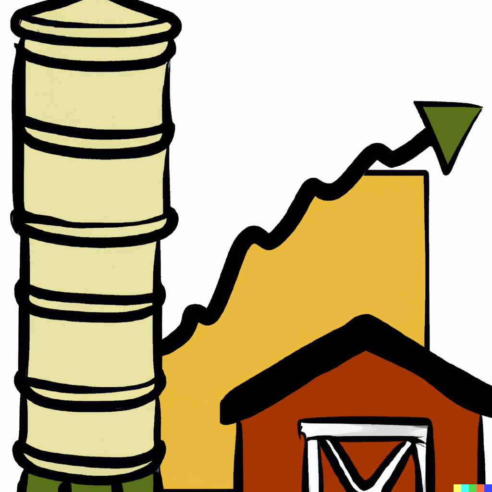

```{r setup, include=FALSE}
knitr::opts_chunk$set(echo = FALSE)
```

# Price Behavior Over Time

.pull-left[

]

.pull-right[
- Thus far we have considered agricultural markets in a 'static world,' where underlying factors of the demand and supply are fixed.
- Over time, these factors change. For example:
  * demand for meat may shift over time due to changes in dietary preferences;
  * supply of maize may shift each year due to weather shocks, or it may gradually shift due to technological advancement. 
- The dynamic behavior of commodity prices is a consequence of such changes. ]

---


# Price Behavior Over Time

.right-column[
- These changes may result in trends, seasonality, and cycles in the commodity prices dynamics. 
- A commodity price series may exhibit one or several of these features (e.g., seasonality is a likely feature of annually harvested agricultural commodity prices; prices of meat typically follow a cyclical pattern, etc.).
]

---


# Price Behavior Over Time

.right-column[
- Changes in the underlying factors of a commodity price behavior may result in shifts and switches of the commodity price trends, or altered seasonal or cyclical patterns. 
  * e.g., previously perishable products&mdash;such as meat, eggs, butter&mdash;became 'storable' with the invention of refrigeration, which also impacted the price dynamics of these agricultural commodities. 
]

---


# Trends and Shifts in Prices

.right-column[
- Commodity prices may exhibit time-specific shifts in price levels.
- A continuum of such shifts result in price trends. 
- Trends usually are presented by persistent upward (or downward) movements in prices over a reasonably long period of time. 
]

---


# Trends and Shifts in Prices

.right-column[
- Recall that observed prices are equilibrium market prices, governed by supply and demand schedules. 
- For an observable trend in a commodity price series, continuous relative shifts in supply and demand must occur. 
  * For example, a continuous stream of new production technology may cause the supply function to steadily shift rightward, resulting in a downward trend in observed prices.  
]

---


# Trends and Shifts in Prices

.right-column[
- For agricultural commodities, a major factor in year-to-year price variability is change in annual supply. 
- Crops have swings in annual production, because of changing expectations about returns as well as climatic and biological factors of production. 
- Inventories and imports may mitigate the effects of a small crop in a particular region, unless the effect has worldwide manifestation.  
]

---


# Trends and Shifts in Prices

.right-column[
- In contrast to somewhat stable year-to-year changes, there are occasions when price levels shift to (and remain at) a new level. 
- This may happen as a result of an abrupt (or, possibly, gradual within a relatively short period of time) structural change in commodity markets. 
  * For example, the entry of the Soviet Union into the world market for grains in 1973 created a new source of demand that persisted, which resulted in a substantially high nominal prices. 
  * More recently, the so-called 'ethanol boom' in the U.S. has shifted the prices of corn to a new, higher level.  
]

---


# Seasonality of Prices

.right-column[
- Seasonal price behavior is a systematic pattern that occurs within a year, and repeats across the years. 
- For food and agricultural commodities, the main source of seasonality is the supply-side effects. Although, demand-side effects are also occasionally evident 
  * For example, high demand for turkey meat in the U.S. around the Thanksgiving period in November. 
]

---


# Seasonality of Prices

.pull-left[
- Assuming an annually produced storable commodity, and a perfectly competitive market, prices will be lowest just after the harvest, and rise at the rate of *cost of storage* per unit of time.
]

.pull-right[
```{tikz season, out.width='100%', fig.asp=1.0, dpi=200, fig.align='center', echo=FALSE, warning=FALSE, cache=FALSE}
\begin{tikzpicture}[scale=1]
% Draw axes
\draw[<->,thick] (0,8) node[below left] {$p$} -- (0,0) -- (13,0) node[below left] {$t$};
\clip (0,0) rectangle (12,7);
\draw [very thick] plot [smooth] coordinates {(1,2) (5,5) (6,2) (10,5) (11,2) (15,5)};

\draw [thick,dashed] (5.5,6) node[above] {harvest} -- (5.5,0);

\end{tikzpicture}
```
]

---


# Seasonality of Prices

.right-column[
- The typical seasonal price pattern does not prevail each year. Prices may rise by more than the cost of storage, or they may even decline over the season. 
- People act upon information related to expected production, available stocks, and expected changes in demand for a commodity. But the information is subject to change throughout the season. And prices will reflect those changes.
]

---


# Seasonality of Prices

.right-column[
- The storage costs within a year&mdash;implicitly depicted in the seasonal pattern of prices&mdash;can be divided into the four components: 
  * The costs of inputs; 
  * The opportunity costs (which depends on the price of the commodity and interest rates); 
  * The convenience yield (of holding stocks); 
  * The risk associated with the expected future price of a commodity.
]

---


# Seasonality of Prices

.right-column[
- As the storage season (or the marketing year) progresses, not only prices increase, but they also become more volatile. That is, the price volatility immediately after harvest is smaller than the price volatility during the months later in the marketing year. 
- Within a marketing year, inventories are declining, and when inventories are small late in the season, changes in expectations can have a large price effects (spikes).
]

---


# Price Cycles and the Cobweb Model

.right-column[
- A cycle is a pattern that repeats itself over a time period that is longer than one year. The simplest variant of a price cycle has a fixed period, but such cycles are rare. 
- Cycle-like behavior of prices is typically initiated by an external event (say, a drought). Such events manifest irregularly and with varying intensity, which play role in patterns of price cycles. 
- Moreover, due to the very nature of production process, the cycles may be asymmetric - i.e., a positive shock of a given magnitude may result in dynamics that is different from dynamics due to a negative shock of the same magnitude.
]

---


# Price Cycles and the Cobweb Model

.right-column[
- Two factors facilitate cyclical behavior in commodity prices:
  * the way expectations are formed, and 
  * the costs associated with responding to changed expectations. 
- Due to the production lag, profit-maximizing decisions rely on expected (rather than actual) prices.
]

---


# Price Cycles and the Cobweb Model

.right-column[
- To illustrate the point, consider a case of *naive expectations*: $$p_{t+1}^{*} = p_{t},$$ where $p_{t+1}^{*}$ denotes the expected price for period $t+1$, which is equal to an observed price in period $t$. In addition, assume a competitive market (producers are price-takers), a market clearing price adjustment, and a static supply and demand. 

]

---


# Price Cycles and the Cobweb Model

.pull-left[
- Under the foregoing assumptions, a (one-off) shock to the market will result in a price (and quantity) cycles that will gradually dissolve. 
]

.pull-right[
```{tikz cobweb, out.width='90%', fig.asp=1.0, dpi=200, fig.align='center', echo=FALSE, warning=FALSE, cache=FALSE}
\begin{tikzpicture}[scale=1]
% Draw axes
\draw[<->,thick] (0,10) node[below left] {$P$} -- (0,0) -- (12,0) node[below left] {$Q$};

\draw[solid,very thick] (1,1) to (9,9) node[below right]{$S$};
\draw[solid,very thick] (1,8) to (10,2) node[below right]{$D$};

\draw[->,dashed,thick] (0,7) to (7,7);
\draw[->,dashed,thick] (7,7) to (7,4);
\draw[->,dashed,thick] (7,4) to (4,4);
\draw[->,dashed,thick] (4,4) to (4,6);
\draw[->,dashed,thick] (4,6) to (6,6);
\draw[->,dashed,thick] (6,6) to (6,4.67);
\draw[->,dashed,thick] (6,4.67) to (4.67,4.67);
\draw[->,dashed,thick] (4.67,4.67) to (4.67,5.55);
\end{tikzpicture}
```
]

---


# Price Cycles and the Cobweb Model

.right-column[
- Somewhat more 'sophisticated' models assume some form of *adaptive expectations*. Such models incorporate multiple lags of prices (i.e., $p_{t-1},p_{t-2},\dots$) in forming the expected price of a commodity. 
- The expected price then can be a weighted average of current and past prices, e.g., a prediction from an autoregressive process. To that end, the naive expectations is a special case of the adaptive expectations.
]

---

# Readings


.pull-left[

]

.pull-right[
Tomek & Kaiser, Chapter 9
]
