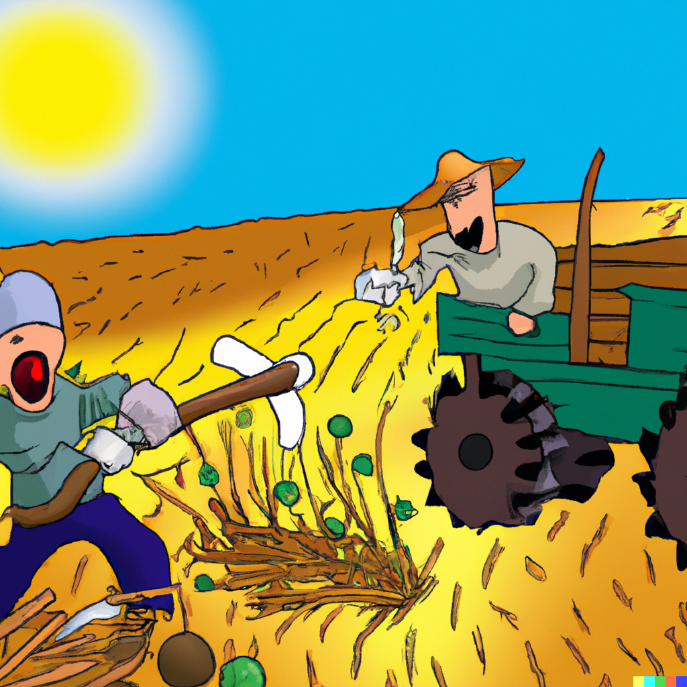
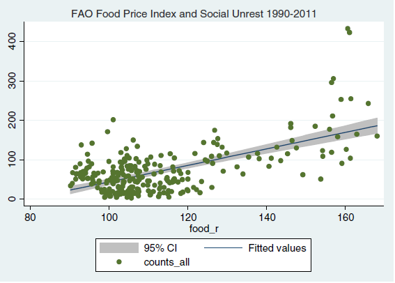
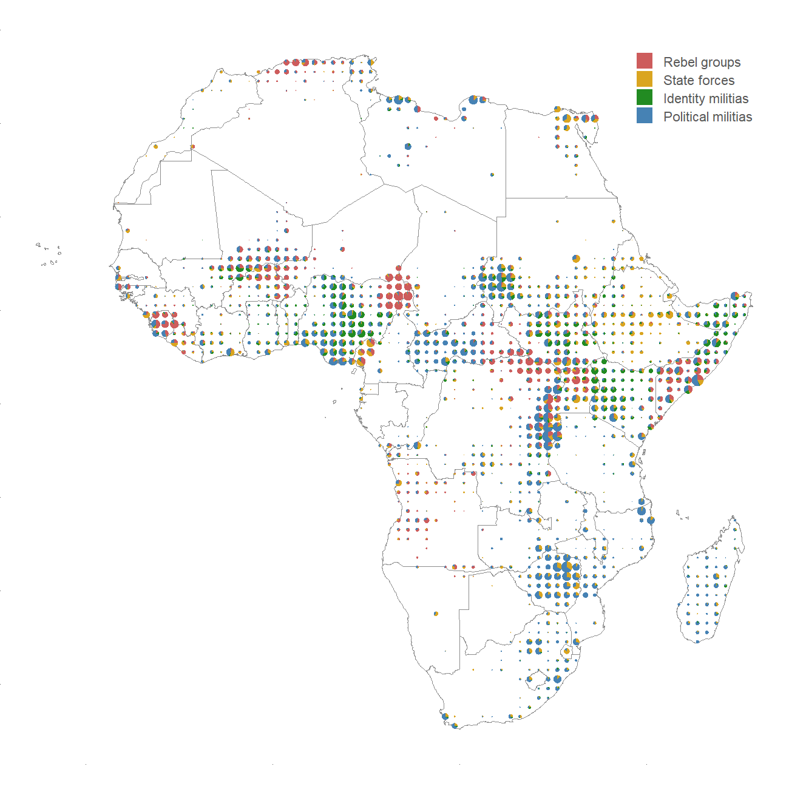
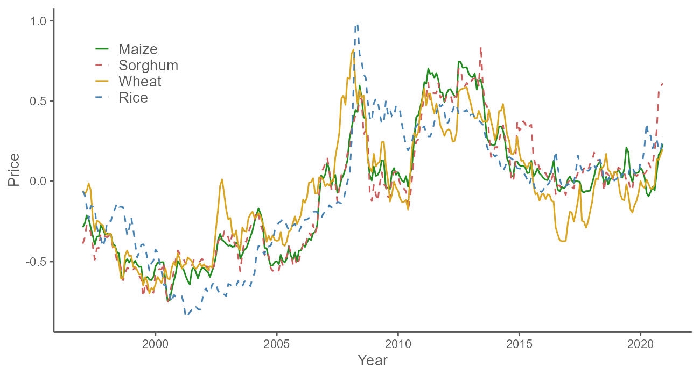
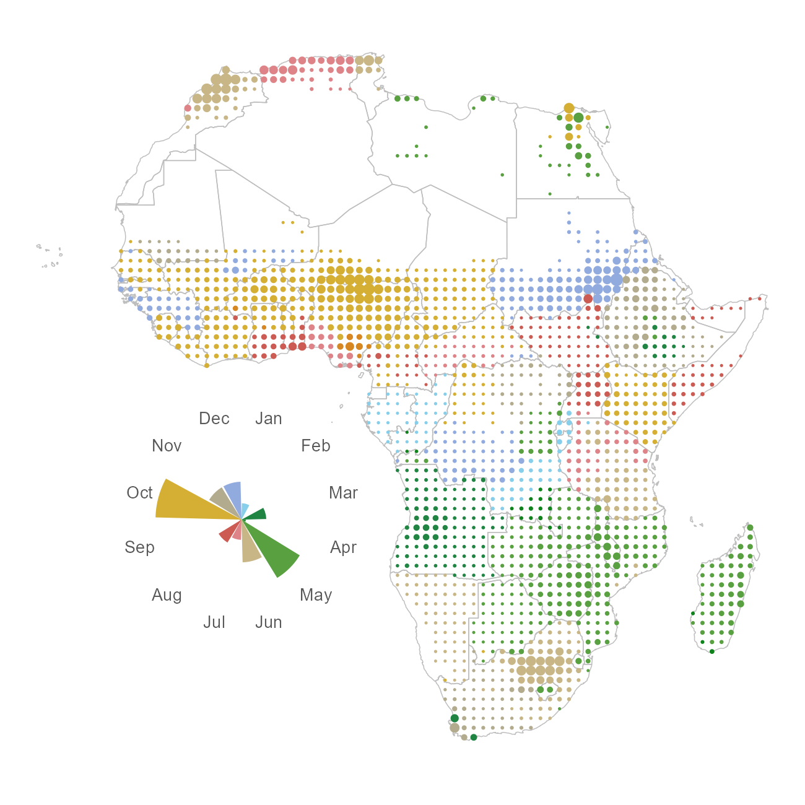
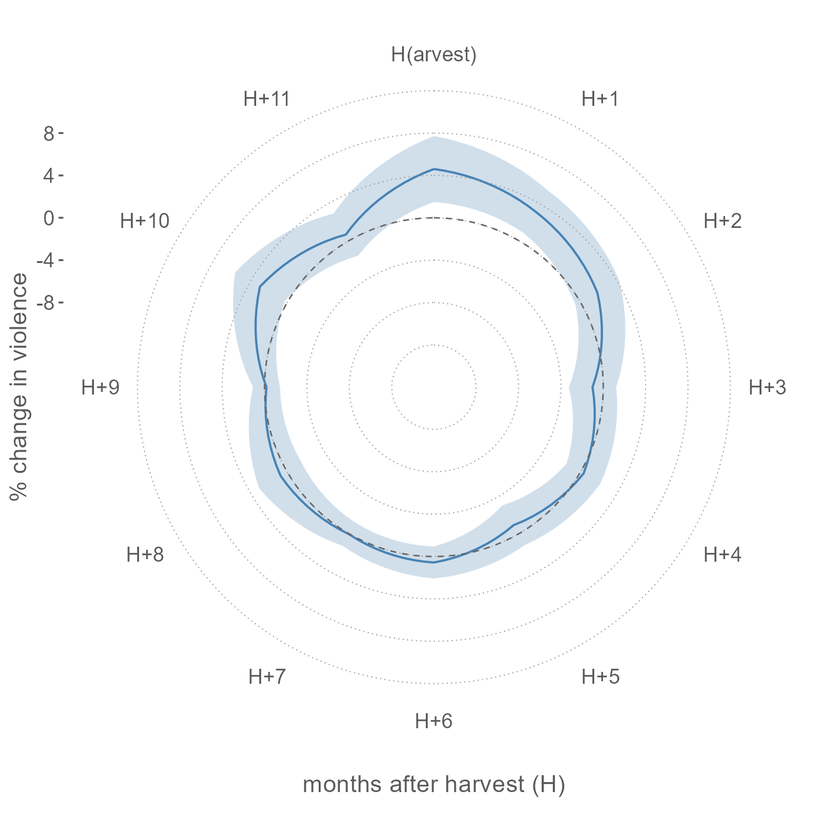
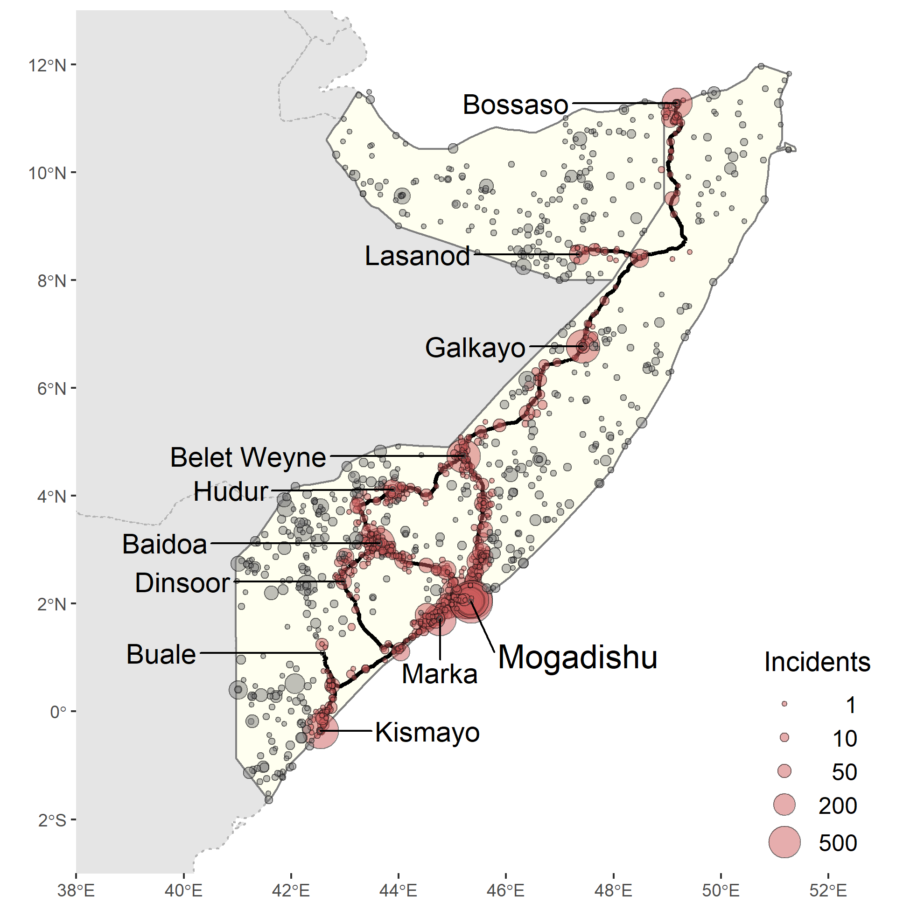
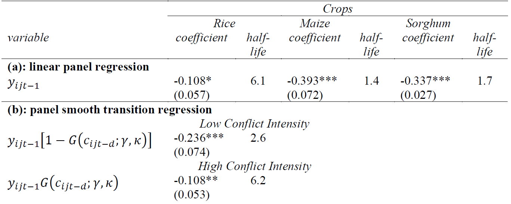

```{r setup, include=FALSE}
knitr::opts_chunk$set(echo = FALSE)
library(ggplot2)
library(knitr)
```

# Agriculture can cause or result in conflict 

.pull-left[

]

.pull-right[
- Agricultural production and prices can be the cause, as well as the consequence of social unrest and civil conflict.
- While not exactly the reason for the Ukraine War, agricultural production and distribution ended up being the targets of the attackers.
- While the Ukraine war unfolded far from Africa or Asia, pundits have warned against the real possibility that conflict and violence could likely follow in countries that rely on agricultural imports from the war region.
]

---

# Social unrest in urban areas

.right-column[
- In urban areas, which 'import' food from rural areas, an increase in price of important commodities will reduce people's real income. Under some circumstances (e.g., in low-income countries with less than ideal rule of law) this can easily lead to *food riots*.
- Indeed, food riots are believed to have contributed to revolutions and demises of ruling regimes (e.g., the Arab Spring). 
]

---

# Food riots

.right-column[
```{r fig.align="left", out.width = "70%", dpi=200}
 
```

Source: [Bellemare, 2015](https://onlinelibrary.wiley.com/doi/abs/10.1093/ajae/aau038)
]

---

# COnflict and violence in rural areas

.right-column[
- In rural areas, an increase in price of locally produced commodities will increase people's real income. 
- The effect of such change can be ambiguous.
- On the one hand, the *opportunity cost mechanism* will result in the reduction of conflict and violence.
- On the other hand, the *rapacity mechanism* will result in more conflict and violence. 
]

---

# The opportunity cost mechanism

.right-column[
- The opportunity cost mechanism relies on a theory that an individual gets to choose between 'farming' and 'fighting.'
- When agricultural commodity prices are high, farming should be the preferred mode of 'employment,' as fighting presents risks to once life, and, after all, it is illegal.
- When prices drop, returns from fighting will outweigh the income from farming, and individuals will choose to engage in unlawful activities (e.g., [Dube and Vargas, 2013](https://academic.oup.com/restud/article/80/4/1384/1579342)).
]

---


# The rapacity mechanism

.right-column[
- The rapacity mechanism relies on a theory that increase in income facilitates conflict and violence as the mean and the consequence of appropriating wealth.
- When agricultural commodity prices rise, farmers accumulate wealth, which attracts perpetrators (e.g., [McGuirk and Burke, 2020](https://www.journals.uchicago.edu/doi/full/10.1086/709993)).
]

---

# Agrarian conflict can be seasonal

.right-column[
- Across (Sub-Saharan) Africa,
  * more than 60% of population live in rural areas;
  * more than 50% of total employment is in agriculture;
  * in some countries (e.g., Niger, Somalia, Uganda), agricultural employment is in excess of 70%.
- The inherently seasonal pattern of employment and income in agriculture can have its footprint on socio-economic outcomes, including on political violence, because of:
  * the intermittent employment in the sector throughout the marketing year; 
  * the abrupt influx of income during or shortly after harvest. 
]

---


# Some anecdotes

.right-column[
- March 2017: a farmer killed as he resisted an attempt to loot his sorghum on his way to market (South Sudan).
- July 2016: "Perci" beat a farmer, stole a bag of rice (DRC). 
- July 2019: Ahlu Sunna Waljama’a attacked farmers harvesting rice, burned plantations, stole food (Mozambique).
- September 2017: armed pastoralists killed a farmer, and looted his food (Sudan).
]

---


# Opportunity cost mechanism and seasonality

.right-column[
- The seasonal employment lends itself to the opportunity cost mechanism of conflict in agricultural sector.
- [Guardado and Pennings (2020)](https://elibrary.worldbank.org/doi/abs/10.1596/1813-9450-9373) investigate this mechanism of conflict seasonality, and show that in Afghanistan, Iraq, and Pakistan, the onset of the harvest reduces conflict.
]
 
---


# Rapacity mechanism and seasonality

.right-column[
- Rapacity, in agricultural sector, is likely to be seasonal as looting and appropriation will likely to be present most prominently shortly after the harvest, and dissipate gradually as the marketing year progresses. 
- The higher the value of a crop, the more likely it is that a farmer will engage in a conflict with potential perpetrators. 
]

---


# Conflict prevalence across Africa

.pull-right[
```{r out.width='80%'}

```
]

---


# Prices of the major cereals

.right-column[
```{r out.width='100%'}

```
]

---


# Geographic distributon of the harvest season

.pull-right[
```{r out.width='80%'}

```
]

---


# Main result

.pull-right[
```{r out.width='80%'}

```
]

---


# Key takeaways

.right-column[
- The culprit is militias, specifically political militias; state forces and rebel groups play little role in "agricultural violence."
- A 1 S.D. annual price growth of the cereal grain increases violence by up to 5% during the harvest month.
- The effect dissipates in the following months.
- The effect is larger or more prolonged in the wake of favorable weather conditions during the growing season.
]

---


# Prices can be a consequence of conflict

.right-column[
- Conflict disturbs markets by destroying the infrastructure (especially during civil wars), the existing business relationships, and by increasing the risk for business activities.
- Thus, conflict serves as a transaction cost, and at times as an insurmountable barrier to trade, which can lead to high food prices in the importing regions (e.g., urban or non-agricultural areas).
]

---


# Conflict in the world's most conflict-prone country

.pull-right[
```{r fig.align="left", out.width = "70%", dpi=200}
 
```

Source: [Hastings, et al. (2022)](https://academic.oup.com/jae/article-abstract/31/3/272/6299941)
]

---


# Main result


.right-column[
```{r out.width='100%'}

```
]

---


# Key takeaways

.right-column[
- Despite a lack of functioning formal economic institutions that span the entire country, Somali cereal markets are relatively well integrated or are in equilibrium across distances and internal borders; 
- Civil conflict, and the associated armed violence, slows but does not eliminate price transmission of imported rice; 
- Conflict does not appear to be a defining element in price transmission of locally produced maize and sorghum.
]

---


# Readings

.pull-left[

]

.pull-right[
[Bellemare, 2015](https://doi.org/10.1093/ajae/aau038)

[Dube and Vargas, 2013](https://doi.org/10.1093/restud/rdt009)

[Guardado and Pennings (2020)](https://elibrary.worldbank.org/doi/abs/10.1596/1813-9450-9373)

[Hastings, et al. (2022)](https://doi.org/10.1093/jae/ejab012)

[McGuirk and Burke, 2020](https://doi.org/10.1086/709993)

[Ubilava, et al. (2023)](https://doi.org/10.1111/ajae.12364)


]
