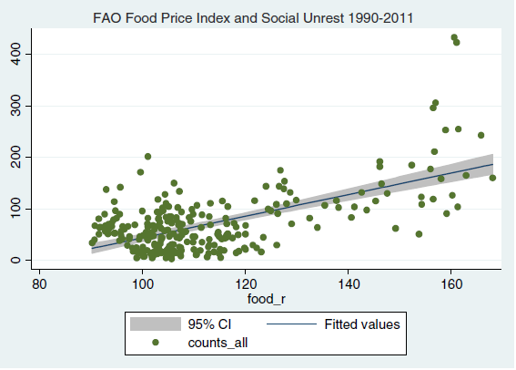
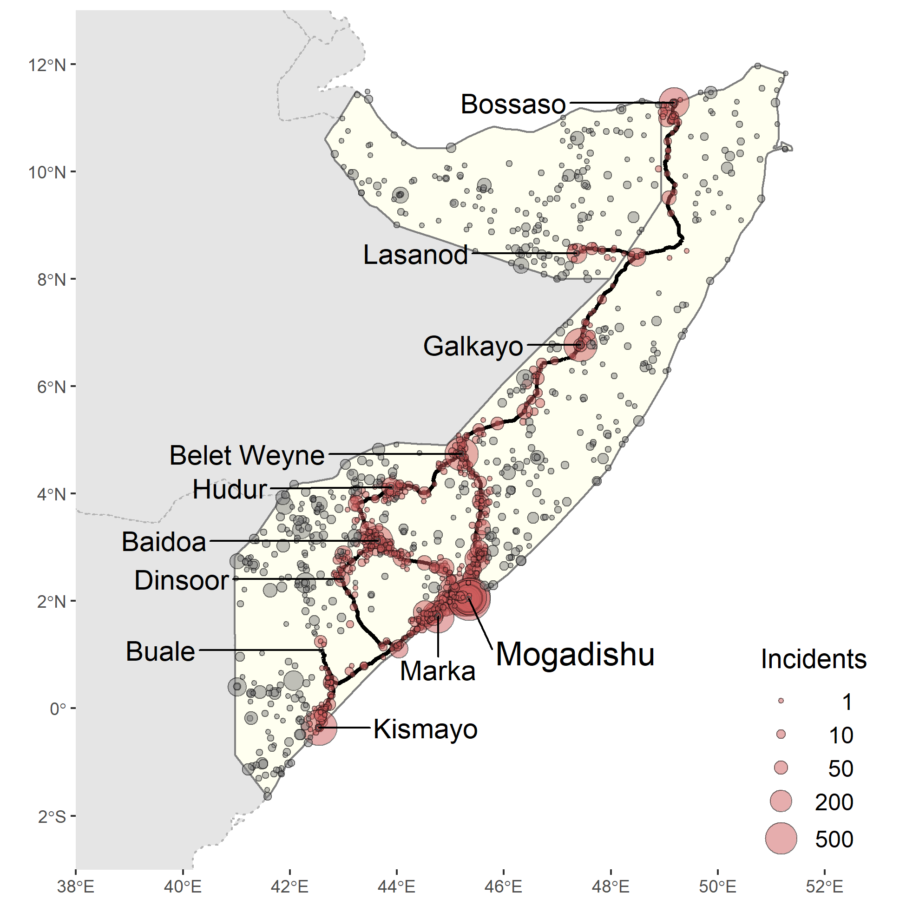

```{r setup, include=FALSE}
knitr::opts_chunk$set(echo = FALSE)
library(ggplot2)
library(knitr)
```


# Prices can be a reason for conflict

- Prices of agricultural commodities can be the cause, as well as the consequence of social unrest and civil conflict.
- In urban areas, which 'import' food from rural areas, an increase in price of important commodities will reduce people's real income. Under some circumstances (e.g., in low-income countries with less than ideal rule of law) this can easily lead to *food riots*.
- Indeed, food riots are believed to have contributed to revolutions and demises of ruling regimes. 

---

# Prices can be a reason for conflict

```{r fig.align="center", out.width = "70%", dpi=200}
 
```

Source: [Bellemare, 2015](https://onlinelibrary.wiley.com/doi/abs/10.1093/ajae/aau038)

---

# Prices can be a reason for conflict

- In rural areas, an increase in price of locally produced commodities will increase people's real income. 
- The effect of such change can be ambiguous.
- On the one hand, the *opportunity cost mechanism* will result in the reduction of conflict and violence.
- On the other hand, the *rapacity mechanism* will result in more conflict and violence. 

---

# Prices can be a reason for conflict

- The opportunity cost mechanism relies on a theory that an individual gets to choose between 'farming' and 'fighting.'
- When agricultural commodity prices are high, farming should be the preferred mode of 'employment,' as fighting presents risks to once life, and, after all, it is illegal.
- When prices drop, returns from fighting will outweigh the income from farming, and individuals will choose to engage in unlawful activities.

---


# Prices can be a reason for conflict

- The rapacity mechanism relies on a theory that increase in income facilitates conflict and violence as the mean and the consequence of appropriating wealth.
- Thus, when agricultural commodity prices are high, farmers accumulate wealth, which attracts perpetrators.

---


# Prices can be a consequence of conflict

- Conflict disturbs markets by destroying the infrastructure (especially during civil wars), the existing business relationships, and by increasing the risk for business activities.
- Thus, conflict serves as a transaction cost, and in some instances as an insurmountable barrier to trade, which can lead to high food prices in the importing regions (e.g., urban or non-agricultural areas).

---


# Prices can be a consequence of conflict

```{r fig.align="center", out.width = "50%", dpi=200}
 
```

Source: [Hastings, et al. (2021)](https://academic.oup.com/jae/advance-article-abstract/doi/10.1093/jae/ejab012/6299941)

---


# Readings

[Bellemare, 2015](https://onlinelibrary.wiley.com/doi/abs/10.1093/ajae/aau038)

[Dube and Vargas, 2013](https://academic.oup.com/restud/article-abstract/80/4/1384/1579342)

[Hastings, et al. (2021)](https://academic.oup.com/jae/advance-article-abstract/doi/10.1093/jae/ejab012/6299941)
